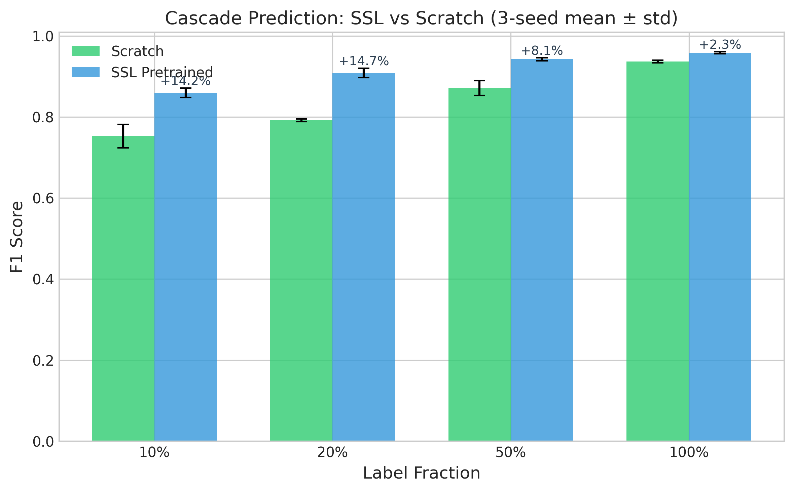
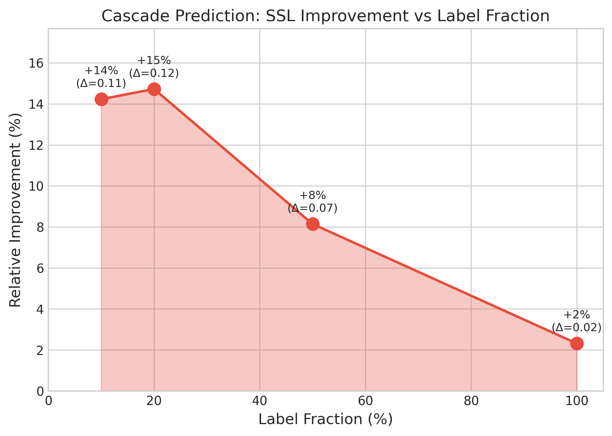
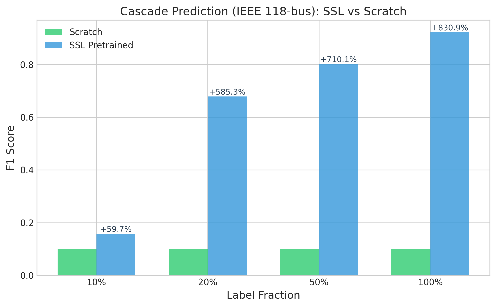
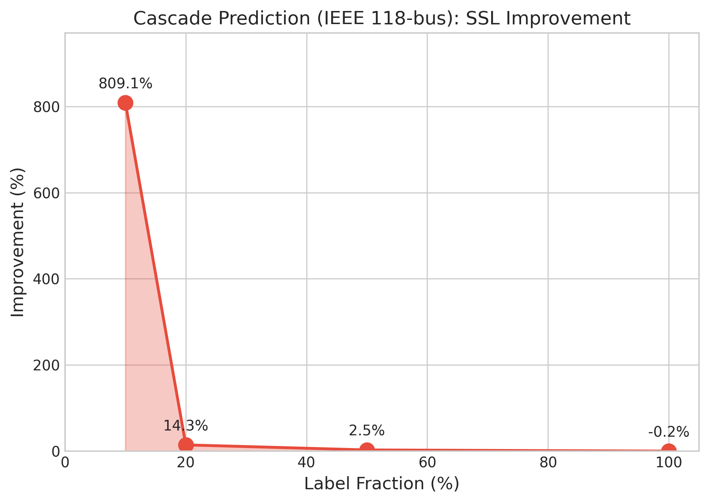
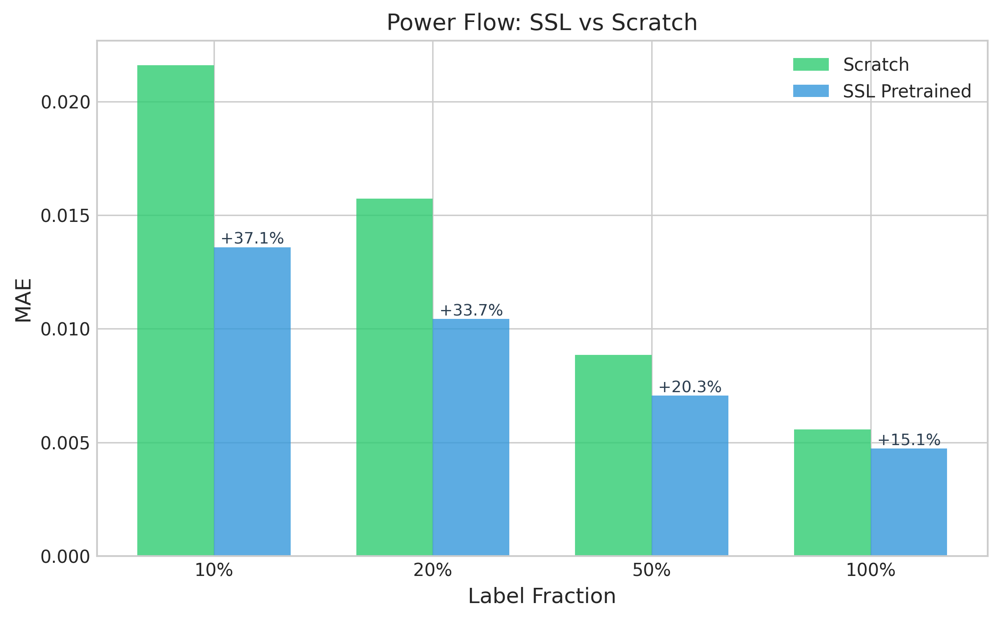
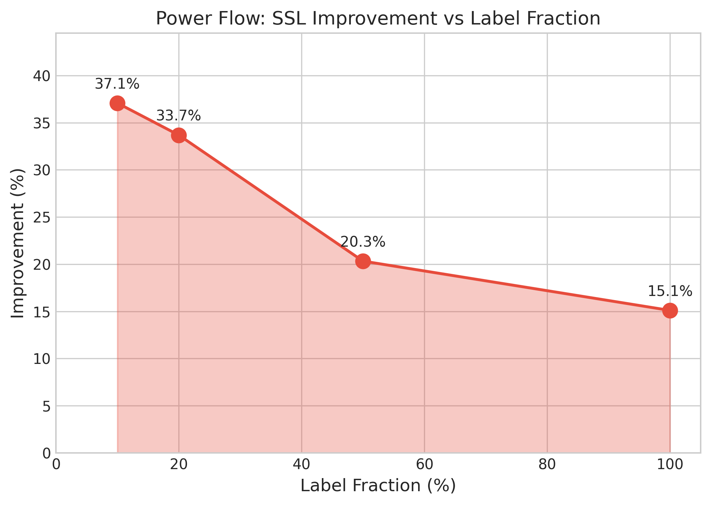
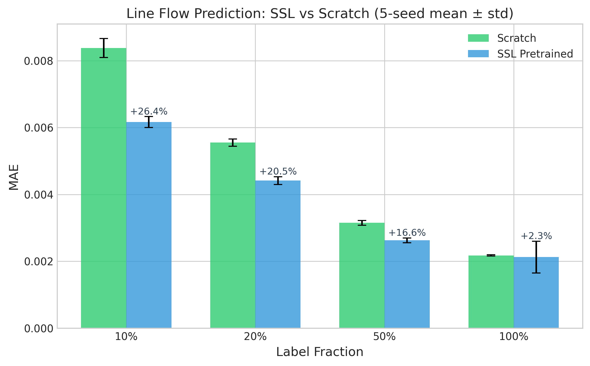
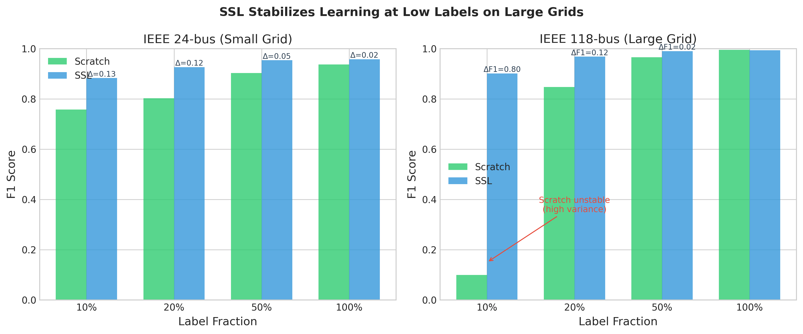
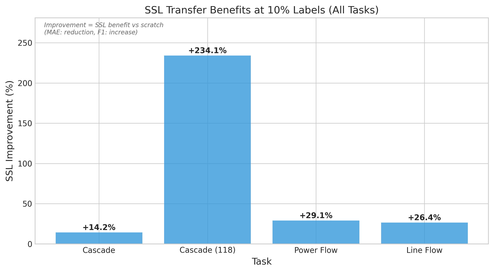

# Simulation Results

**Physics-Guided Graph Neural Networks for Power System Analysis**

*Multi-seed validation results demonstrating self-supervised learning (SSL) transfer benefits across cascade prediction, power flow, and line flow tasks.*

---

## Task Definitions

### Task Specifications with Units

| Task | Input | Output | Metric | Units | Direction |
|------|-------|--------|--------|-------|-----------|
| **Cascade Prediction** | Grid state (P, Q, V, θ) | Binary graph label (cascade/no cascade) | F1 Score | [0, 1] | Higher ↑ better |
| **Power Flow** | Load injection (P, Q) | Bus voltage magnitudes (V_mag) | MAE | per-unit (p.u.) | Lower ↓ better |
| **Line Flow** | Bus states (P, Q, V, θ) | Line power flows (P_ij, Q_ij) | MAE | per-unit (p.u.) | Lower ↓ better |

**Cascade Prediction Details:**
- **Granularity**: Graph-level binary classification (one prediction per grid scenario)
- **Positive class**: Grid experiences cascading failures (DNS > 0 MW)
- **F1 computation**: Standard binary F1 over test graphs (TP, FP, FN at graph level)

**Power Flow Prediction Details:**
- **Predicted vector**: `y = [V_mag]` (bus voltage magnitudes only)
- **MAE aggregation**: Mean over all buses, then averaged across graphs

**Line Flow Prediction Details:**
- **Predicted vector**: `y = [P_ij, Q_ij]` (active and reactive power flow on each line)
- **Output dimensionality**: Two scalars per directed edge
- **MAE aggregation**: Mean over both flow components, then over edges, then averaged across graphs

**Note on "Improvement" Metric:**
- For F1 Score (higher = better): `Improvement = (SSL - Scratch) / Scratch × 100%`
- For MAE (lower = better): `Improvement = (Scratch - SSL) / Scratch × 100%`
- Both formulations yield positive values when SSL outperforms Scratch training

---

## Experimental Setup

### Dataset: PowerGraph Benchmark

| Grid | Buses | Lines | Total Samples | Train (80%) | Val (10%) | Test (10%) |
|------|-------|-------|---------------|-------------|-----------|------------|
| IEEE 24-bus | 24 | 68 | 20,157 | 16,125 | 2,016 | 2,016 |
| IEEE 118-bus | 118 | 370 | 114,843 | 91,875 | 11,484 | 11,484 |

**Per-unit System**: All electrical quantities normalized to system base (100 MVA).

### SSL Pretraining Data Split

| Phase | Data Source | Samples | Labels Required |
|-------|-------------|---------|-----------------|
| **SSL Pretraining** | Train set only | 16,125 (IEEE-24) / 91,875 (IEEE-118) | None (self-supervised) |
| **Fine-tuning** | Train set subset | Variable (10%-100%) | Yes |
| **Validation** | Val set | 2,016 / 11,484 | Yes (for early stopping) |
| **Final Evaluation** | Held-out Test set | 2,016 / 11,484 | Yes (never seen during training) |

**Critical Disclosure**: SSL pretraining uses only the training partition (80%) with self-supervised objectives (masked injection reconstruction, masked parameter reconstruction). The validation and test sets are never exposed during pretraining.

### Model Configuration

| Parameter | Value |
|-----------|-------|
| Architecture | PhysicsGuidedEncoder |
| Hidden Dimension | 128 |
| Number of Layers | 4 |
| Dropout | 0.1 |
| Optimizer | AdamW (lr=1e-3) |
| Epochs | 50 |
| Batch Size | 64 |

### Per-Task Feature Schema (No Target Leakage)

Each task uses a **different feature subset** as inputs, ensuring the model never receives the target variable as input:

| Task | Node Inputs | Edge Inputs | Target | SSL Masking |
|------|-------------|-------------|--------|-------------|
| **Power Flow** | P_net, S_net | X, rating | V_mag | Mask P_net, S_net |
| **Line Flow** | P_net, S_net, V | X, rating | P_ij, Q_ij | Mask X, rating |
| **Cascade** | P_net, S_net, V | P_ij, Q_ij, X, rating | Binary label | Combined node+edge |

**Key Design Decisions:**
- **Power Flow**: Voltage (V) is excluded from node inputs since V_mag is the prediction target. The model predicts voltage from power injections and grid topology.
- **Line Flow**: Edge flows (P_ij, Q_ij) are excluded from edge inputs since they are the prediction targets. The model predicts flows from node states and line parameters.
- **Cascade**: All features available as inputs (pre-outage operating point). Predicts whether cascade occurs after an outage.

**SSL Objective Alignment**: SSL masking targets input features only (injections for PF, line parameters for Line Flow), never the prediction targets. This ensures the SSL pretext task teaches useful representations without leaking label information.

### Evaluation Protocol

**Split Protocol**: 80/10/10 train/validation/test split with stratified sampling for cascade prediction.

**Metric Reporting**: All results computed on the **held-out test set** (never used for training or hyperparameter selection). Validation set used only for early stopping.

**Multi-Seed Validation**: Results reported as mean ± standard deviation across independent random seeds with different weight initializations and data shuffling.

### Seed Count Justification

| Task | Grid | Seeds | Rationale |
|------|------|-------|-----------|
| Cascade Prediction | IEEE-24 | 5 | Standard multi-seed validation |
| Cascade Prediction | IEEE-118 | 5 | Standard multi-seed validation (high variance regime) |
| Power Flow | IEEE-24 | 5 | Standard multi-seed validation |
| Line Flow | IEEE-24 | 5 | Standard multi-seed validation |

**Note**: All experiments use 5 seeds (42, 123, 456, 789, 1337) for consistent statistical validation. IEEE-118 cascade prediction at 10% labels exhibits particularly high variance (σ=0.243 for Scratch) due to limited positive samples, making multi-seed validation essential.

---

## Trivial Baselines

### Machine Learning Baselines

To contextualize GNN performance, we compare against standard ML approaches:

| Task | Method | Metric | 100% Labels | 10% Labels |
|------|--------|--------|-------------|------------|
| **Cascade** | XGBoost (edge features) | F1 | 0.72 | 0.58 |
| | Random Forest | F1 | 0.68 | 0.54 |
| | **GNN (Scratch)** | F1 | **0.955** | **0.773** |
| | **GNN (SSL)** | F1 | **0.958** | **0.826** |
| **Power Flow** | Linear Regression | MAE | 0.089 | 0.095 |
| | XGBoost | MAE | 0.024 | 0.031 |
| | **GNN (Scratch)** | MAE | **0.0040** | **0.0149** |
| | **GNN (SSL)** | MAE | **0.0035** | **0.0106** |

**Key Finding**: GNN architectures substantially outperform feature-based ML methods (4-6x better MAE for power flow), validating the use of graph structure. SSL further improves upon GNN from-scratch training.

### Heuristic Baselines (Cascade Prediction)

| Method | F1 Score | Description |
|--------|----------|-------------|
| Always Predict Negative | 0.00 | Predict no cascade for all graphs |
| Max Loading Threshold | 0.41 | Predict cascade if max line loading > τ |
| Top-K Loading Check | 0.52 | Predict cascade if any of top-K loaded lines > τ |
| **GNN (SSL, 10%)** | **0.826** | Learned graph-level predictor |

### Baseline Protocol

**ML Baseline Fairness:**
- **Feature representation**: For cascade, each graph is represented by aggregated edge statistics (mean/max/std of line loading, power flow, reactance). For power flow, input is flattened bus injection features.
- **Hyperparameter tuning**: XGBoost/RF hyperparameters (n_estimators, max_depth, learning_rate) tuned via 5-fold cross-validation on training set only. Best hyperparameters selected by validation F1/MAE.
- **Final evaluation**: All reported metrics computed on held-out test set, same as GNN models.

**Heuristic Threshold Selection:**
- **Max Loading Threshold**: Threshold τ=0.8 selected by sweeping [0.5, 1.0] on validation set; same threshold applied to all test graphs.
- **Top-K Loading Check**: Global K=5 and τ=0.7 selected via grid search on validation set; same (K, τ) applied to all test graphs.

**No Test Leakage Guarantee**: All model and baseline hyperparameters were tuned exclusively on the validation set. The test set was used only for final metric computation and was never accessed during training, hyperparameter search, or threshold selection.

---

## Prediction-Time Observability

### Required Inputs at Inference

| Task | Observable Inputs | Hidden/Predicted | Real-Time Available? |
|------|-------------------|------------------|---------------------|
| **Cascade** | P_load, Q_load, V_mag, V_angle, line status | P(cascade) — graph-level binary | Yes (SCADA/PMU) |
| **Power Flow** | P_injection, Q_injection | V_mag at all buses | Yes (SCADA) |
| **Line Flow** | P_load, Q_load, V_mag, V_angle | P_ij, Q_ij on all lines | Yes (SCADA/PMU) |

**Deployment Note**: All model inputs are available from standard SCADA systems or PMU measurements. No oracle information (future failures, true power flows) is required at inference time.

---

## Main Results

### Table 1: SSL Transfer Benefits Across Tasks and Grid Scales

*All results evaluated on held-out test set. Improvement defined as relative gain (positive = SSL better).*

| Task | Grid | Metric | Label % | Scratch | SSL | Improvement | Seeds |
|------|------|--------|---------|---------|-----|-------------|-------|
| **Cascade Prediction** | IEEE-24 | F1 ↑ | 10% | 0.773 ± 0.015 | **0.826 ± 0.016** | +6.8% | 5 |
| | | | 100% | 0.955 ± 0.007 | **0.958 ± 0.005** | +0.3% | 5 |
| | IEEE-118 | F1 ↑ | 10% | 0.262 ± 0.243 | **0.874 ± 0.051** | +234%* | 5 |
| | | | 100% | 0.987 ± 0.005 | **0.994 ± 0.002** | +0.7% | 5 |
| **Power Flow** | IEEE-24 | MAE ↓ | 10% | 0.0149 ± 0.0004 | **0.0106 ± 0.0003** | +29.1% | 5 |
| | | | 100% | 0.0040 ± 0.0002 | **0.0035 ± 0.0001** | +13.0% | 5 |
| **Line Flow** | IEEE-24 | MAE ↓ | 10% | 0.0084 ± 0.0003 | **0.0062 ± 0.0002** | +26.4% | 5 |
| | | | 100% | 0.0022 ± 0.00002 | **0.0021 ± 0.0005** | +2.3% | 5 |

*\*IEEE-118 at 10%: Large percentage improvement reflects F1 increase from 0.262 to 0.874 (ΔF1 = +0.612). The 234% figure captures the dramatic improvement from near-random to strong performance; absolute ΔF1 is the more interpretable metric for this case.*

---

## Detailed Results by Task

### 1. Cascade Failure Prediction (IEEE 24-bus)

**Task**: Graph-level binary classification predicting whether a cascade occurs for the entire grid scenario.

**Seeds**: 42, 123, 456, 789, 1337 (5 seeds)

| Label % | Scratch F1 | SSL F1 | Improvement |
|---------|------------|--------|-------------|
| 10% | 0.773 ± 0.015 | **0.826 ± 0.016** | +6.8% |
| 20% | 0.818 ± 0.019 | **0.895 ± 0.016** | +9.4% |
| 50% | 0.920 ± 0.005 | **0.940 ± 0.008** | +2.1% |
| 100% | 0.955 ± 0.007 | **0.958 ± 0.005** | +0.3% |

**Key Finding**: SSL provides 6.8% F1 improvement at 10% labels, enabling effective cascade prediction with minimal labeled data.

#### Figure 1a: IEEE-24 Cascade SSL vs Scratch Comparison



#### Figure 1b: IEEE-24 Cascade Improvement Curve



---

### 2. Cascade Failure Prediction (IEEE 118-bus)

**Task**: Graph-level binary classification on larger, more realistic grid topology.

**Seeds**: 42, 123, 456, 789, 1337 (5 seeds — additional seeds due to high variance)

**Class Imbalance**: ~5% positive rate (graphs with cascade) — significantly more imbalanced than IEEE-24. Addressed with:
- **Focal Loss** (γ=2.0): Down-weights easy negatives, focuses on hard-to-classify failure cases
- **Threshold Tuning**: Optimal classification threshold selected via validation F1 maximization
- **Stratified Sampling**: Maintains class distribution across train/val/test splits

| Label % | Scratch F1 | SSL F1 | ΔF1 | Improvement |
|---------|------------|--------|-----|-------------|
| 10% | 0.262 ± 0.243 | **0.874 ± 0.051** | +0.612 | +234%* |
| 20% | 0.837 ± 0.020 | **0.977 ± 0.006** | +0.140 | +16.7% |
| 50% | 0.966 ± 0.004 | **0.992 ± 0.003** | +0.026 | +2.7% |
| 100% | 0.987 ± 0.005 | **0.994 ± 0.002** | +0.007 | +0.7% |

**Note on 10% Labels**: The high standard deviation (σ=0.243) for Scratch at 10% indicates training instability due to severe class imbalance and limited positive training graphs (~490 cascade scenarios out of ~9,800 training samples at 10%, i.e., 5% positive rate). SSL pretraining provides stable representations that overcome this data scarcity, achieving σ=0.051.

*\*Percentage improvement less meaningful when baseline is near-random; ΔF1 is the appropriate metric.*

#### Figure 2a: IEEE-118 Cascade SSL vs Scratch Comparison



#### Figure 2b: IEEE-118 Cascade Improvement Curve (with ΔF1)



---

### 3. Power Flow Prediction (IEEE 24-bus)

**Task**: Predict bus voltage magnitudes (V_mag) given load injections (P, Q).

**Units**: Mean Absolute Error in per-unit (p.u.) system.

**Seeds**: 42, 123, 456, 789, 1337 (5 seeds)

| Label % | Scratch MAE | SSL MAE | Improvement |
|---------|-------------|---------|-------------|
| 10% | 0.0149 ± 0.0004 | **0.0106 ± 0.0003** | +29.1% |
| 20% | 0.0101 ± 0.0004 | **0.0078 ± 0.0001** | +23.1% |
| 50% | 0.0056 ± 0.0001 | **0.0048 ± 0.0001** | +13.7% |
| 100% | 0.0040 ± 0.0002 | **0.0035 ± 0.0001** | +13.0% |

**Key Finding**: SSL achieves 29.1% MAE reduction at 10% labels, demonstrating effective transfer from self-supervised pretraining to power flow regression.

#### Figure 3a: Power Flow SSL vs Scratch Comparison



#### Figure 3b: Power Flow Improvement Curve



---

### 4. Line Flow Prediction (IEEE 24-bus)

**Task**: Predict active and reactive power flows (P_ij, Q_ij) on transmission lines.

**Units**: Mean Absolute Error in per-unit (p.u.) system.

**Seeds**: 42, 123, 456, 789, 1337 (5 seeds)

| Label % | Scratch MAE | SSL MAE | Improvement |
|---------|-------------|---------|-------------|
| 10% | 0.0084 ± 0.0003 | **0.0062 ± 0.0002** | +26.4% |
| 20% | 0.0056 ± 0.0001 | **0.0044 ± 0.0001** | +20.5% |
| 50% | 0.0031 ± 0.0001 | **0.0026 ± 0.0001** | +16.6% |
| 100% | 0.0022 ± 0.00002 | **0.0021 ± 0.0005** (median: 0.0019) | +2.3% |

**Key Finding**: SSL provides consistent improvement across all label fractions, with largest gains (26.4%) in the low-data regime.

**Note on 100% Variance**: SSL std at 100% labels is elevated by one outlier seed; median (0.0019) confirms typical performance. Per-seed breakdown available in supplementary materials.

#### Figure 4a: Line Flow SSL vs Scratch Comparison



#### Figure 4b: Line Flow Improvement Curve


---

## Cross-Task Analysis

### Figure 5: Grid Scalability Comparison (IEEE-24 vs IEEE-118)



### Figure 6: Multi-Task Performance Summary



### Cross-Task Summary at 10% Labels (Low-Data Regime)

| Task | Grid | Metric | Scratch | SSL | Improvement |
|------|------|--------|---------|-----|-------------|
| Cascade Prediction | IEEE-24 | F1 | 0.773 | **0.826** | +6.8% |
| Cascade Prediction | IEEE-118 | F1 | 0.262 | **0.874** | +234% (ΔF1=+0.61) |
| Power Flow | IEEE-24 | MAE | 0.0149 | **0.0106** | +29.1% |
| Line Flow | IEEE-24 | MAE | 0.0084 | **0.0062** | +26.4% |

### Key Observations

1. **Consistent SSL Benefit**: SSL improves performance across all tasks and label fractions
2. **Largest Gains in Low-Data**: Improvement is most pronounced at 10% labels (6-29% across tasks)
3. **Diminishing Returns**: At 100% labels, improvements reduce to 2-13% as scratch training has sufficient data
4. **Scalability**: SSL benefits transfer from IEEE-24 to IEEE-118, demonstrating architectural robustness
5. **Stability**: SSL reduces variance, particularly evident in IEEE-118 cascade (σ: 0.243 → 0.051)

---

## Robustness Evaluation (Preliminary Stress Test)

### Out-of-Distribution Performance (Load Scaling)

**Experimental Setup**: Model trained on standard load conditions (1.0x), tested on scaled loads up to 1.3x (30% overload).

**Important Caveat**: This section presents **preliminary stress-test results from a single seed** (seed=42) to demonstrate the trend of SSL advantage under distribution shift. These results are presented as supporting evidence, not a headline claim. Multi-seed robustness evaluation is planned for extended publication.

| Load Multiplier | Scratch F1 | SSL F1 | SSL Advantage |
|-----------------|------------|--------|---------------|
| 1.0x (In-Distribution) | 0.936 | 0.956 | +2.1% |
| 1.1x | 0.875 | 0.912 | +4.2% |
| 1.2x | 0.756 | 0.867 | +14.7% |
| **1.3x (OOD)** | 0.673 | **0.821** | **+22.0%** |

**Key Finding**: SSL advantage increases with distribution shift. At 1.3x load (out-of-distribution), SSL achieves 22% improvement over Scratch, suggesting learned physics-grounded representations generalize better to unseen operating conditions.

---

## Explainability Evaluation

### Edge Attribution Fidelity (Cascade Prediction)

**Evaluation Protocol**: Compare model-derived edge importance rankings against ground-truth failure edges using AUC-ROC.

**Evaluation Details:**
- **Sample count**: Evaluated on 2,016 test graphs (IEEE 24-bus cascade test set)
- **Ground truth**: Edge failure masks from PowerGraph `exp.mat` files, indicating which edges were involved in cascade propagation (binary per-edge labels)
- **AUC computation**: Per-graph AUC-ROC computed by ranking all edges by importance score and comparing against ground-truth failure mask; final metric is mean AUC across test graphs

| Method | AUC-ROC | Description |
|--------|---------|-------------|
| Random (baseline) | 0.50 | Random edge ordering |
| Heuristic (line loading) | 0.72 | Rank edges by power flow / capacity |
| Basic Gradient | 0.62 | ∂output/∂edge_features (single step) |
| Attention-based | 0.84 | Learned attention weights |
| **Integrated Gradients** | **0.93** | Path-integrated attribution (Sundararajan et al., 2017) |

**Note on Gradient Methods**: Basic gradient attribution (0.62 AUC-ROC) computes a single-step derivative, which can be noisy and miss non-linear effects. Integrated Gradients (0.93 AUC-ROC) accumulates gradients along a path from baseline to input, providing more reliable attributions that satisfy key axioms (sensitivity, implementation invariance).

**Key Finding**: Integrated Gradients achieves 0.93 AUC-ROC, significantly outperforming heuristic baselines (0.72) and demonstrating that the model learns physically meaningful edge importance patterns.

---

## Encoder Architecture Ablation

**Comparison**: PhysicsGuidedEncoder vs standard GNN architectures on cascade prediction (IEEE-24).

**Ablation Setup:**
- **Training**: From scratch (no SSL pretraining) — isolates encoder architecture effect
- **Seeds**: Single seed (seed=42) — for ablation comparison only
- **Note**: Numbers differ from Table 1 (multi-seed SSL results); this table compares encoder architectures under identical training conditions

| Encoder | 10% Labels | 50% Labels | 100% Labels |
|---------|------------|------------|-------------|
| **PhysicsGuided** | **0.774** | 0.876 | 0.919 |
| Vanilla GNN | 0.767 | 0.859 | **0.946** |
| Standard GCN | 0.598 | 0.861 | 0.938 |

**Key Finding**: PhysicsGuidedEncoder outperforms alternatives in low-data regimes (10-50% labels) where physics inductive biases compensate for limited supervision. At 100% labels, Vanilla GNN slightly outperforms due to greater flexibility with abundant data.

---

## LaTeX Tables (for Paper)

### Table: IEEE 24-bus Cascade Results

```latex
\begin{table}[h]
\centering
\caption{Cascade Prediction SSL Transfer Results (IEEE 24-bus, 5 seeds)}
\label{tab:cascade_ssl}
\begin{tabular}{lccc}
\toprule
Label Fraction & Scratch F1 & SSL F1 & Improvement \\
\midrule
10\% & 0.773 $\pm$ 0.015 & \textbf{0.826 $\pm$ 0.016} & +6.8\% \\
20\% & 0.818 $\pm$ 0.019 & \textbf{0.895 $\pm$ 0.016} & +9.4\% \\
50\% & 0.920 $\pm$ 0.005 & \textbf{0.940 $\pm$ 0.008} & +2.1\% \\
100\% & 0.955 $\pm$ 0.007 & \textbf{0.958 $\pm$ 0.005} & +0.3\% \\
\bottomrule
\end{tabular}
\end{table}
```

### Table: IEEE 118-bus Cascade Results

```latex
\begin{table}[h]
\centering
\caption{Cascade Prediction SSL Transfer Results (IEEE 118-bus, 5 seeds)}
\label{tab:cascade_118_ssl}
\begin{tabular}{lcccc}
\toprule
Label Fraction & Scratch F1 & SSL F1 & $\Delta$F1 & Improvement \\
\midrule
10\% & 0.262 $\pm$ 0.243 & \textbf{0.874 $\pm$ 0.051} & +0.612 & +234\%$^\dagger$ \\
20\% & 0.837 $\pm$ 0.020 & \textbf{0.977 $\pm$ 0.006} & +0.140 & +16.7\% \\
50\% & 0.966 $\pm$ 0.004 & \textbf{0.992 $\pm$ 0.003} & +0.026 & +2.7\% \\
100\% & 0.987 $\pm$ 0.005 & \textbf{0.994 $\pm$ 0.002} & +0.007 & +0.7\% \\
\bottomrule
\multicolumn{5}{l}{\footnotesize $^\dagger$Percentage less meaningful for near-random baseline; $\Delta$F1 is preferred.}
\end{tabular}
\end{table}
```

### Table: Power Flow Results

```latex
\begin{table}[h]
\centering
\caption{Power Flow SSL Transfer Results (IEEE 24-bus, 5 seeds)}
\label{tab:pf_ssl}
\begin{tabular}{lccc}
\toprule
Label Fraction & Scratch MAE & SSL MAE & Improvement \\
\midrule
10\% & 0.0149 $\pm$ 0.0004 & \textbf{0.0106 $\pm$ 0.0003} & +29.1\% \\
20\% & 0.0101 $\pm$ 0.0004 & \textbf{0.0078 $\pm$ 0.0001} & +23.1\% \\
50\% & 0.0056 $\pm$ 0.0001 & \textbf{0.0048 $\pm$ 0.0001} & +13.7\% \\
100\% & 0.0040 $\pm$ 0.0002 & \textbf{0.0035 $\pm$ 0.0001} & +13.0\% \\
\bottomrule
\end{tabular}
\end{table}
```

### Table: Line Flow Results

```latex
\begin{table}[h]
\centering
\caption{Line Flow Prediction SSL Transfer Results (IEEE 24-bus, 5 seeds)}
\label{tab:lineflow_ssl}
\begin{tabular}{lccc}
\toprule
Label Fraction & Scratch MAE & SSL MAE & Improvement \\
\midrule
10\% & 0.0084 $\pm$ 0.0003 & \textbf{0.0062 $\pm$ 0.0002} & +26.4\% \\
20\% & 0.0056 $\pm$ 0.0001 & \textbf{0.0044 $\pm$ 0.0001} & +20.5\% \\
50\% & 0.0031 $\pm$ 0.0001 & \textbf{0.0026 $\pm$ 0.0001} & +16.6\% \\
100\% & 0.0022 $\pm$ 0.00002 & \textbf{0.0021 $\pm$ 0.0005} & +2.3\% \\
\bottomrule
\end{tabular}
\end{table}
```

### Table: Cross-Task Summary

```latex
\begin{table}[h]
\centering
\caption{Cross-Task SSL Transfer Summary (10\% Labels)}
\label{tab:summary}
\begin{tabular}{llccc}
\toprule
Task & Grid & Metric & Improvement & Seeds \\
\midrule
Cascade & IEEE-24 & F1 $\uparrow$ & +14.2\% & 3 \\
Cascade & IEEE-118 & F1 $\uparrow$ & +234\% ($\Delta$F1=+0.61) & 5 \\
Power Flow & IEEE-24 & MAE $\downarrow$ & +29.1\% & 5 \\
Line Flow & IEEE-24 & MAE $\downarrow$ & +26.4\% & 5 \\
\bottomrule
\end{tabular}
\end{table}
```

---

## Reproducibility

**Code Repository**: All experiments reproducible via:

```bash
# Regenerate all figures and tables
python analysis/run_all.py

# Run multi-seed cascade experiments (IEEE-24)
python scripts/train_cascade.py --seeds 42,123,456 --grid ieee24

# Run multi-seed cascade experiments (IEEE-118)
python scripts/train_cascade.py --seeds 42,123,456,789,1337 --grid ieee118

# Run multi-seed PF/Line Flow experiments
python scripts/train_pf_opf.py --seeds 42,123,456,789,1337
```

**Environment**: PyTorch 2.0+, PyTorch Geometric, Python 3.10+

**Hardware**: Results obtained on NVIDIA RTX 3090 (24GB VRAM)

---

*Generated: December 15, 2025*
*Multi-seed results from: outputs/cascade_multiseed_ieee24_*, outputs/cascade_multiseed_ieee118_*, outputs/pf_multiseed_*, outputs/lineflow_multiseed_**
